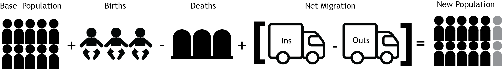
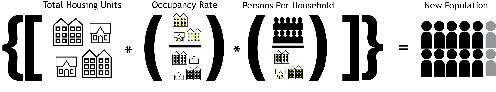
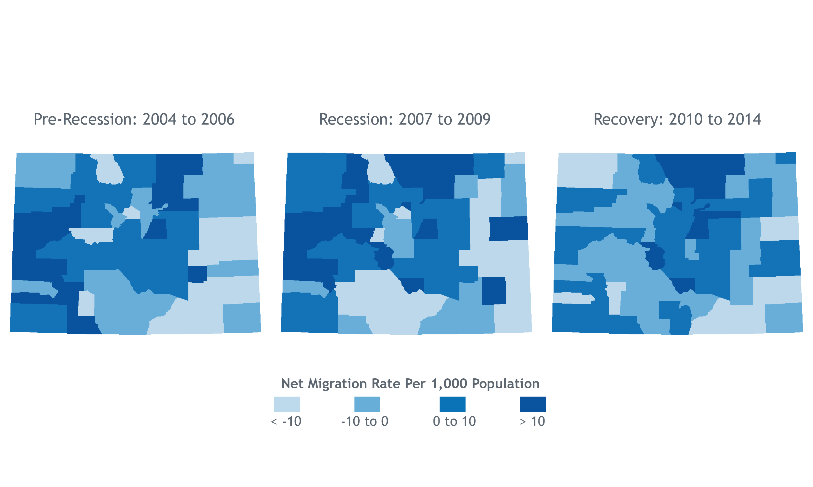
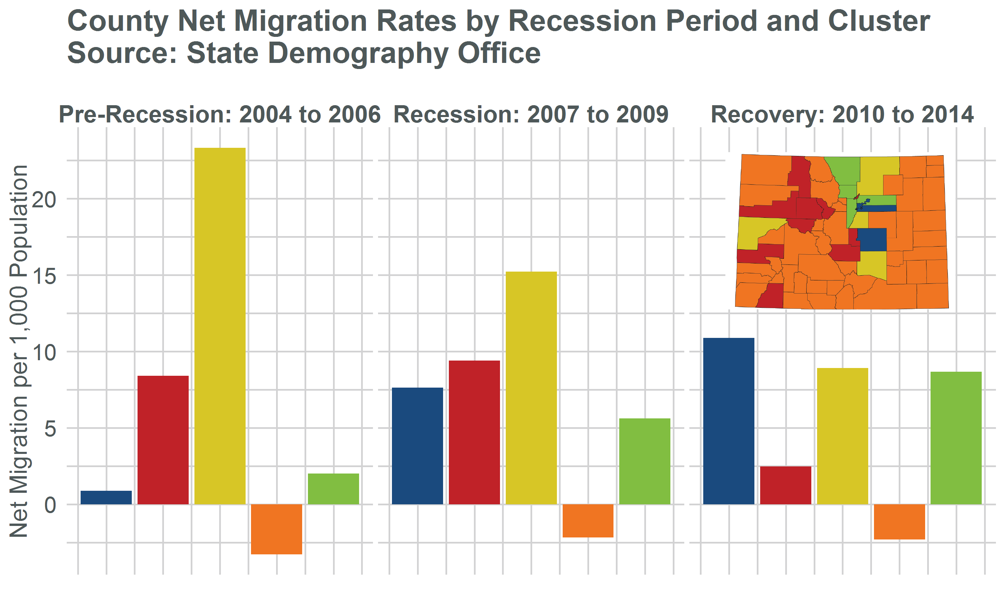

```{r setup, include=FALSE}
knitr::opts_chunk$set(echo = FALSE)
library(codemog)
library(dplyr)
library(tidyr)
library(ggplot2)
library(grid)
library(scales)
library(stringr)

codemog_pal=c(rgb(31,73,125, max=255),
              rgb(192,80,77, max=255),
              rgb(101, 80, 60, max=255),
              rgb(239, 117, 33, max=255),
              rgb(119, 171, 67, max = 255),
              rgb(208, 210, 211, max = 255),
              rgb(210, 210, 210, max = 255))

load("county_profile.rdata")
```

# Introduction

This document is a stand-alone version of the presentation I gave at the 33rd Colorado State Demography Office Annual Meeting. This includes much of the vocal portion recast as text and similar visuals. Please route any comments or questions to Rob Kemp (robert.kemp@state.co.us, 303-864-7755) or file a GitHub  [Issue](https://github.com/robkemp/Annual_Meeting_Presentation_Document/issues). You could also contact me on Twitter: @_robkemp.


# Population Estimates Methodology

Each year the State Demography Office in the Colorado Department of Local Affairs produces population estimates for all counties, municipalities, unincorporated areas, and Conservation Trust Fund Title 32 Special Districts.  This amounts to about 522 geographies overall.  For a more detailed dive into our methods click [here](https://drive.google.com/a/state.co.us/file/d/0B-vz6H4k4SESNm5hb1NmQWZWdlU/view).

**Data Produced for Release:**

- Total Population
- Household Population
- Group Quarters Population
- Total Housing Units
- Occupied Housing Units (Households)
- Vacant Housing Units
- Persons per Household (Household Size)


## County Methodology

Our county estimates are created by taking a base population (the Census 2010 population moved to July 1 by tracking components) and adding natural increase and net migration to come up with the next year's estimate.  This process is repeated for each year until the most current.  



Each year these data are revised back to the base year as the estimate for the new year is created, this process is called Vintage, which is why we refer to each new set of estimates as a vintage.  This year we are releasing Vintage 2014 estimates.  The county estimates are the base for all other estimates, they are summed to generate the state estimates and are controls for sub-county estimates.

## Sub-County Methodology

Our methodology changes for municipal, unincorporated areas, and special districts.  We use the Housing Unit Method for these geographies because of frequent boundary change, the lack of reliable migration data for these areas, and stability of housing unit estimates over time.  To put it more plainly, people move a lot and places annex a lot, but housing units tend to stay where they are.  This methodology takes the housing unit counts in the Census and tracks change in those housing units through building permits and certificates of occupancy.  Vacancy rates and persons per household data from the Census are used to estimates the population in the area.  These estimates are broken down into parts based on which municipalities and counties the areas are in.  At the end of the process, all of the estimates need to sum to the county totals and are adjusted to do so (through a process called raking).  This process is repeated for each year, taking the prior year as a base



Similarly, these data are revised back to the base year each time a new year is added.

## Estimates Calendar

Month	|Process
--------------|-------------
November to December	|Collect Housing Unit and Group Quarter Data
January to April|	Receive and process input data and boundary changes.
May	|Create draft county, municipality and district estimates and send to local governments for review
June to July	|Receive and review population challenges and provide support to local governments.
August	|Release population estimates.
September	|Create tables and databases for website 


# Colorado's Population Landscape

The United States has a population of 318,857,056 in 2014, growth of 2.3 million (0.7%) from 2013.  Colorado grew by 82,485 (1.6%) to 5,353,471 in 2013.  Colorado ranks as the second largest state in the Mountain Region (CO, MT, ID, WY, UT, NV, AZ, NM).  Colorado ranks 4th in Nation for percentage growth in population behind North Dakota, Nevada, and Texas.  Even more impressive, Colorado ranks 8th in the Nation for absolute population growth behind Texas, California,Florida, Georgia, Arizona, North Carolina, and Washington.  This is especially remarkable because large states like Texas and California have large bases to grow from and can add large numbers of people with very slow growth.  However, to put this in perspective, Harris County, TX (Houston) added more population than Colorado.

Despite incredible overall growth, population growth is not ubiquitous and population change varies greatly across the state. The map below shows changes in total population.


The bulk of population growth since 2010 has been concentrated in the Front Range, specifically from El Paso County north through Denver to Larimer and Weld counties.  Notably, there is significant population decline on the Eastern Plains and in some Western Slope counties.  The concentration of growth is even more stark when considering Net Migration.


Net migration is almost entirely focused in the Front Range with even large Western Slope counties like Mesa experiencing net out migration since 2010.  This shows that in many non-Front Range counties, growth is primarily due to natural increase, which largely a result of population that already lives in those places.

## County Population Rankings

**Population Growth**

Rank| County | Population Change
--------|-------- | ----------
1|Denver County	| 15,242		
2|Arapahoe County|	10,903	
3|Adams County	|10,381	
4|Douglas County|	8,068		
5|El Paso County|	7,967	


**Population Decline**

Rank| County | Population Change
--------|-------- | ----------
1|Delta County|	-328
2|Las Animas County|	-314
3|Prowers County|	-258
4|Moffat County|	-228
5|Kit Carson County|	-204


**Largest by Population**

Rank| County | Population
--------|-------- | ----------
1|El Paso County |	665,070
2|Denver County	|664,220
3|Arapahoe County|	618,341
4|Jefferson County|	558,532
5|Adams County	|480,317

**Smallest by Population**

Rank| County | Population
--------|-------- | ----------
1|Mineral County |	697
2|San Juan County	|718
3|Hinsdale County	|769
4|Kiowa County	|1,385
5|Jackson County|	1,388


## Municipal Population Rankings


**Largest Mincipalities**

Rank| Municipality | Population
-----|---------|--------
1 |Denver |	664,220
2|Colorado Springs|	443,965
3|Aurora| 	350,773
4|Fort Collins|	154,570
5|Lakewood|	149,666
6|Thornton |	129,403
7|Arvada |	113,326
8|Westminster|	111,834
9|Pueblo|	108,177
10|Centennial|	107,501

**Largest Population Change **

Rank| Municipality | Population Change
-----|---------|--------
1	|Denver	|15,242
2	|Aurora|	5,731
3	|Colorado Springs|	5,017
4	|Fort Collins|	2,653
5	|Lakewood|	2,637
6	|Greeley|	2,201
7	|Boulder|	2,173
8	|Loveland	|1,994
9	|Thornton|	1,953
10|	Commerce City	|1,933


## Percentage Population Change

**Fastest Growing Counties**

Rank| County | Percent Change (Total Change)
-----|---------|--------
1	|Crowley	|5.1% (271)
2	|Gilpin|	4.6% (258)
3	|Broomfield|	2.7% (1,654)
4	|Douglas	|2.6% (8,068)
5	|San Juan	|2.6% (18)
6|	Larimer|	2.4% (7,709)
7	|Jackson|	2.4% (33)
8|	Denver|	2.3% (15,242)
9|	Summit|	2.2% (640)
10|	Adams	|2.2% (10,381)

*Note: Crowley grew predominantly due to growth in the number of prisoners in the county.*


**Fastest Growing Municipalities**

Rank| Municipality | Percent Change (Total Change)
-----|---------|--------
1|	Timnath	|30.2% (458)
2|	Seibert|	21.0% (38)
3	|Glendale	|14.0% (616)
4|	Woodland Park|	13.2% (945)
5|	Johnstown|	10.3% (1,237)
6|	Lone Tree	|9.1%   (1,116)
7|	Berthoud|	7.8%   (413)
8|	Wellington|	7.5%   (502)
9|	Frederick|	7.4%   (755)
10|	Sheridan|	6.3%   (460)

## Population Change: Broken Down

Population's change through either natural increase, number of births - number of deaths, or net migration, number of in-migrants minus the number of out-migrants.  These are often called components of change. Natural increase has been steady and increasing somewhat since 1970, but births and deaths have varied over time.  As seen in the figure below, births have finally begun to recover from the slow-down experienced during the recession while deaths are continually rising due to both population growth and population aging.

```{r}


county_profile%>%
  filter(year>=2000, countyfips==0)%>%
  select(countyfips, year, Births=births, Deaths=deaths)%>%
  gather(variable, value, Births:Deaths)%>%
  ggplot(aes(x=year, y=value, color=variable))+
  geom_line(size=1.1)+
  scale_y_continuous(label=comma)+
  scale_colour_manual(name="",values=codemog_pal)+
  theme_codemog()+
  labs(x="Year", y="Number", title="Colorado Births and Deaths\nSource: State Demography Office")
```


Net migration is far more variable over time than natural increase is.  Net migration is very closely related with economic health and job creation, particularly in how Colorado is doing relative to the rest of the United States.  The chart below shows net migration from 2000 to 2014.  The year 2000 marked the highest net migration level in Colorado history, but was followed by years of very low net migration due to the impact of the early-2000s "Tech Bust."  Net migration began to recover in 2006, but wsa yet again dampened by a recession, the "Great Recession." Colorado faired better in the Great Recession than the rest of the Nation and did not see the same drop off in net migration experienced in other states.  Net migration had recovered to the pre-recession peak by 2013 and continues to grow in 2014.


```{r}

county_profile%>%
  filter(year>=2000, countyfips==0)%>%
  select(countyfips, year,netMigration)%>%
  ggplot(aes(x=year, y=netMigration, group=countyfips))+
  geom_bar(stat="identity", fill=rgb(31,73,125, max=255))+
  scale_y_continuous(label=comma)+
  theme_codemog()+
  labs(x="Year", y="Net Migration", title="Colorado Net Migration\nSource: State Demography Office")
```

# Migration and the Great Recession

## The Basics

* From July 1, 2013 to July 1, 2014, Colorado’s Net Migration was 50,778.
    + Net Migration Rate: 9.49 per 1,000 Population.
  
* Colorado is the 44th most Native State.
    + 42.9% of Current Residents were Born in Colorado.
    + About 58.7% of U.S. Residents live in the State they were born in.
  
* Three Biggest Trading Partners: CA, TX, NY


## Migration Rates over time

The graph below shows Colorado's net migration rate from 2004 to 2014 with shading denoting periods of time related to the recession.  These periods are related to periods of job growth showing the 2004 to 2006 period as 'Pre-Recession', the 2007 to 2010 period as the 'Recession' since those represent the so-called 'peak' and 'trough' of the job trend, and 2010 to 2014 as the 'Recovery' since that period marks consistent job growth overall.  The migration rate had begun to recover from the early-2000s recession during the Pre-Recession period, but declined during the recession.  Migration continued to decline into the Recovery period but began to increase again after 2011.  The migration rate for Colorado finally recovered to the pre-recession peak in 2013 and for the first time in 2014 is now higher.  


```{r}
data=readr::read_csv("netMigData_AnnMeet2015.csv")
netMigCluster=readr::read_csv("netMigClusters_AnnualMeeting.csv")

data%>%
  filter(year>=2004)%>%
  group_by(year)%>%
  summarize(totalPopulation=sum(totalPopulation),
            netMigration=sum(netMigration))%>%
  mutate(netMigrationRate=(netMigration/totalPopulation)*1000)%>%
  ggplot(aes(x=year,y=netMigrationRate))+
  geom_line(size=1.15, color=rgb(31,74,126, max=255))+
  geom_rect(aes(xmin=2004, xmax=2007, ymin=-Inf, ymax=+Inf), fill=rgb(31,74,126, max=255) ,alpha=.03)+
  geom_rect(aes(xmin=2007, xmax=2010, ymin=-Inf, ymax=+Inf), fill=rgb(191,32,38, max=255),alpha=.03)+
  geom_rect(aes(xmin=2010, xmax=2014, ymin=-Inf, ymax=+Inf), fill=rgb(216, 199, 34, max=255),alpha=.03)+
  annotate("text",x=2005.5, y=9.25, label="Pre-Recession", size=5, color=rgb(78, 87, 88, max = 255), family="sans")+
  annotate("text",x=2008.5, y=9.25, label="Recession", size=5, color=rgb(78, 87, 88, max = 255), family="sans")+
  annotate("text",x=2012, y=9.25, label="Recovery", size=5, color=rgb(78, 87, 88, max = 255), family="sans")+
  theme_codemog()+
  labs(title="Colorado Net Migration Rate by Recession Period\nSource: State Demography Office\n", x="", y="Net Migration per 1,000 Population")

```

These overall trends though mask changes in where the net migration was going within the state. The figure below shows net migration rates by county for each of the three periods.  Pre-recession, migration was far more dispersed geographically, especially important was the strong net migration on the Western Slope during this period due to the Oil-Shale boom. During the recession net migration began to shift toward the Front Range, but the Western Slope stayed strong as they were later into the recession owing to a bust in the Oil-Shale industry.  The recovery period shows how dominant the Front Range has been, particularly showing the continuing the strength of the Northern Front Range.




To further investigate this, I used a method called k-means clustering to identify clusters of counties based on their total number of jobs and net migration rates during the recovery period.  The follow chart shows the results of this preliminary analysis.  The counties in yellow are those that were strong growers in the pre-recession period, but have cooled off or even begun to see negative net migration in come cases.  These are still important growth engine counties.  Counties in red were predominantly tourism-based economies and while they stayed strong through the recession, they've seen much lower migration rates during the recovery.  The counties in green and blue had very low migration rates in the pre-recession period, but during the recession and recovery, saw dramatic increases in their net migration, reflecting the move toward the Front Range and areas of economic diversity.  Finally, those counties in orange that, in general, were losing migrants before the recession, are still losing migrants, but at a lower rate.  


